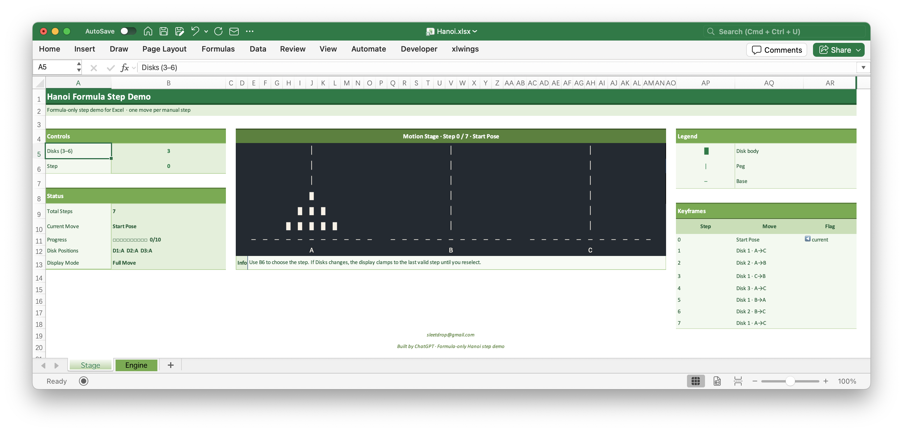

# Hanoi Formula Step Demo

An Excel-based Tower of Hanoi animation demo built entirely with formulas — no VBA, macros, or scripts required.

## Overview

This workbook demonstrates a step-by-step Tower of Hanoi simulation directly inside Excel.  
Users can adjust the number of disks and manually step through each move to see the puzzle state update on the motion stage.

## Preview

The screenshot below shows the main `Stage` sheet, including the control panel, motion stage, legend, and step-by-step keyframes.

The visual stage updates as the step value changes, allowing users to follow each Tower of Hanoi move directly inside Excel.

## Features

- Formula-only implementation
- Supports 3–6 disks
- Manual step control
- Animated-style motion stage
- Move list and current-step highlighting
- No macros or external dependencies

## How to Use

1. Open the Excel workbook.
2. Go to the `Stage` sheet.
3. Set the number of disks in the controls area.
4. Change the step value to move through the solution.
5. Watch the disk positions update on the motion stage.

## Workbook Structure

- `Stage` — main interactive display and controls
- `Engine` — formula logic and move calculations

## Requirements

- Microsoft Excel with modern formula support
- Macros are not required
