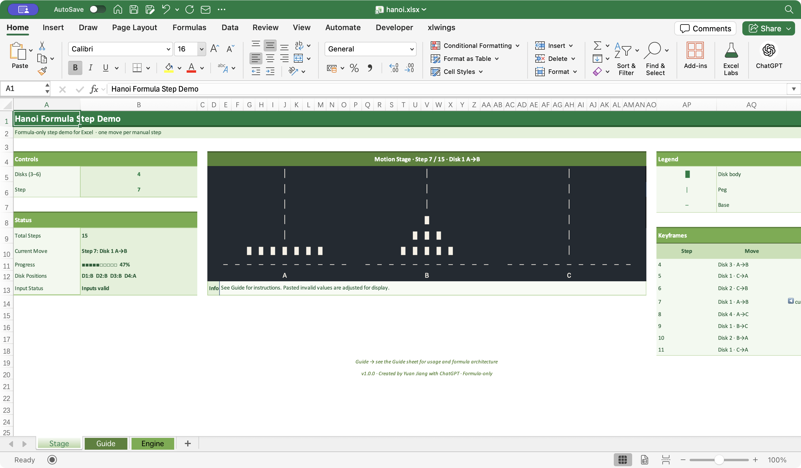

# Tower of Hanoi in Excel

A step-by-step Tower of Hanoi visualization implemented entirely with modern Excel formulas—no VBA, macros, Office Scripts, add-ins, or external runtimes.

## Preview

The preview shows four disks at step 7, with the current move, progress, dot-matrix stage, legend, and keyframes visible together.

## Try It / Download

[Download the workbook](https://raw.githubusercontent.com/sleetdrop/vibexcel/main/Hanoi/hanoi.xlsx), open it in Microsoft Excel, and use the controls on `Stage`. If Excel opens the downloaded file read-only or in Protected View, enable editing.

## Quick Start

1. Open `hanoi.xlsx` and stay on `Stage`.
2. Choose 3–6 disks in **Disks**.
3. Change **Step** from 0 through the displayed maximum.
4. Watch the stage, current move, progress, and highlighted keyframe update.

If a value is pasted outside the supported range, the workbook shows the safe effective value it is using.

## What It Demonstrates

- A complete puzzle solution generated and queried with formulas only
- An interactive cell-based dot-matrix display driven by ordinary worksheet inputs
- Reusable named `LAMBDA` functions for validation, solver logic, lookup, and display
- Visible formula invariants that check every move and the final state
- A workbook that doubles as an executable artifact and an inspectable notebook

## Workbook Map

- `Stage` — the interactive visualization and controls
- `Guide` — quick-start help, architecture, compatibility, and developer orientation
- `Engine` — linked controls, solved-state table, active move list, integration points, and formula checks

## Formula Architecture

The raw controls on `Stage` are normalized by input-constraint formulas. Solver formulas produce the full legal move sequence and disk positions. Lookup and query helpers select the active state, and display helpers turn that state into the title, status, progress, keyframes, and dot-matrix stage. The compact checks on `Engine` verify the expected step count, one-disk transitions, distinct move endpoints, and the final all-on-C state.

See [Formula architecture](ARCHITECTURE.md) for the data flow, stable worksheet contracts, named-LAMBDA groups, display model, and verification boundary.

## Requirements and Compatibility

- Verified: Microsoft Excel 365 Desktop for macOS
- Unverified: Excel 365 for Windows, Microsoft Excel 2024, and Excel for the Web
- Requires modern dynamic-array and named-`LAMBDA` formula support
- Contains no VBA, macros, Office Scripts, custom functions, external data connections, or external workbook links

## Inspecting the Implementation

Start with `Guide`, then inspect the solved-state table and formula checks on `Engine`. Open Excel's Name Manager to read the exact `HN_*` named formulas and follow their use in the worksheets. The workbook intentionally keeps those definitions in Excel instead of duplicating a separate API reference.

## Feedback and License

Questions and feedback are welcome through [GitHub Issues](https://github.com/sleetdrop/vibexcel/issues). This project is released under the repository's [MIT License](../LICENSE).
