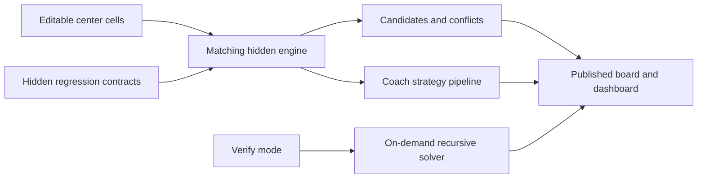

# Sudoku Formula Architecture

This workbook treats modern Excel formulas as an application runtime. Ordinary cells hold state and inputs; dynamic arrays and Named LAMBDA functions implement reusable logic; formatting, validation, and shapes provide the interaction layer.

The workbook itself remains the canonical executable and API reference. This document explains the relationships between its layers without duplicating every formula definition.

## Execution Boundary

All runtime behavior stays inside Excel:

- ordinary worksheet cells and formulas;
- dynamic arrays;
- workbook-scoped Named LAMBDA functions;
- data validation;
- conditional formatting;
- native worksheet shapes used for presentation.

There is no VBA project, macro, Office Script, add-in dependency, network call, or external runtime involved in playing or verifying a puzzle. Repository tooling is used only to publish a reviewable snapshot of formulas already stored in the workbook.

## Workbook Data Flow

Each game page is a presentation surface. Its corresponding engine gathers the 81 logical cell values, derives candidates and conflicts, selects Coach output, and returns compact status values to the published page.

The visual board deliberately uses multiple native Excel cells for each logical Sudoku square. That makes room for a large center value plus nine small candidate positions while preserving ordinary cell entry and formatting behavior.

## Isolated Puzzle Engines

The workbook contains one hidden engine per published puzzle:

- `_Engine` for Easy;
- `_Engine Medium`;
- `_Engine Hard`;
- `_Engine Expert`;
- `_Engine Master`.

Each engine links only to its matching page and stores that puzzle's givens, live board, certified solution, candidate state, conflict map, Coach output, and Verify gate. An entry on one difficulty page cannot influence another puzzle.

Isolation costs some worksheet duplication, but it keeps dependencies explicit and makes each puzzle independently testable. Reusable behavior lives in `SDK_*` Named LAMBDA functions rather than being copied into the five engines.

## Candidate and Validation Layer

`SDK_Candidates(board, row, column)` computes legal digits for a single empty cell using row, column, and 3×3 box exclusion. `SDK_CandidateMatrix(board)` applies that calculation across the full 9×9 board. In the current workbook, all five engines also run `SDKP_Chain(board, 8)` and project its candidate matrix onto the player pages.

Validation operates at several levels:

- `SDK_Conflict` detects a direct duplicate in a row, column, or box;
- dead-cell and dead-unit functions identify local contradictions that do not yet contain a duplicate;
- `SDK_IsSolved` compares all 81 values with the certified solution;
- the published dashboard distinguishes In Progress, Conflict, Dead End, Check Errors, and Solved states.

The fast local checks calculate continuously and support responsive ordinary play.

## Coach Reasoning Pipeline

The Coach selects the simplest supported step in a fixed order:

1. naked single;
2. hidden single in a row;
3. hidden single in a column;
4. hidden single in a box;
5. pointing pair or triple;
6. claiming reduction;
7. naked pair.

The current Coach path reads the bounded `SDKP_Chain` result in each engine. An assignment supplies the hint; the engine formats the same result as a concise Hint or a two-line Trace. The older `SDK_CoachHintV2` and `SDK_CoachTraceV2` functions remain defined, but the five player pages use the chain-connected engine cells.

Strategy functions return a step only when it creates a real assignment or elimination. Synthetic candidate fixtures in `_Tests` exercise structural cases that are awkward to guarantee on the five published starting boards.

## Transparent Fallback

The supported logical strategy set is intentionally finite. A hard puzzle can reach a valid state where none of those techniques yields the next move.

When the chain finds no supported assignment or elimination, the engine calls `SDK_FallbackReveal`, which selects a valid empty square from the stored certified solution. A chain limit or contradiction is reported explicitly instead of being presented as a logical deduction or a certified reveal.

The fallback contract is deliberately explicit:

- it is labeled **Coach reveal**;
- its action states that the value comes from the certified solution;
- it is never described as a logical deduction;
- regression tests validate the target, digit, legality, solution agreement, and source disclosure.

This keeps every published puzzle playable without pretending the Coach implements every known human solving technique.

## On-Demand Recursive Solver

`SDK_Solve(board)` uses recursive backtracking with a minimum-remaining-values branch choice. It rejects conflicts and provable local dead ends early, chooses an empty cell with the fewest candidates, and explores candidate assignments until a solution is found or the branch fails.

Recursive search is intentionally gated behind Coach **Verify**. The engine's Verify cell wraps the solver in an `IF` controlled by the visible mode, so Off, Hint, and Trace do not invoke global search. This is the main performance boundary between responsive gameplay and expensive proof.

`SDK_SolveStatus` converts solver output into explicit `VIABLE`, `NO SOLUTION`, or `SEARCH ERROR` states. Unexpected calculation failures cannot silently masquerade as a legitimate unsolvable board.

## Bounded Uniqueness Certification

Finding one solution does not prove that a puzzle has exactly one. Publication certification therefore uses a separate bounded counting path.

`SDK_CountSolutions(board, limit)` counts valid completions using the same candidate generation, conflict checks, local pruning, and minimum-remaining-values branching. Its branch accumulator stops as soon as the caller's remaining count budget is reached. For uniqueness testing the limit is two, because counts beyond “multiple” provide no additional publication value.

`SDK_Uniqueness` maps the bounded count to `NO SOLUTION`, `UNIQUE`, or `MULTIPLE SOLUTIONS`. All five puzzles shipped in v1.0.0 were certified `UNIQUE`.

Uniqueness checks are release-time evidence rather than continuous gameplay calculations; harder boards can require tens of seconds in the current host.

## Regression Contracts

The hidden `_Tests` worksheet combines known puzzle states with synthetic fixtures. Its contracts cover:

- candidate legality and board validation;
- conflicts and local dead ends;
- exact strategy behavior and real eliminations;
- Coach marker roles and presentation contracts;
- fallback activation, assignment safety, and source disclosure;
- recursive solver status and uniqueness classification;
- five-page startup state and engine wiring;
- release visual gates that formulas cannot directly inspect.

The current workbook retains version **1.0.0** and contains **131 passing checks and 18 on-demand or visual checks**, with no failures while Verify is Off (checked 2026-09-24). The workbook's `README` sheet reports these counts directly from `_Tests` formulas.

## Formula-Only Interaction Limits

Formula-only design creates useful constraints rather than hiding them:

- formulas cannot directly clear a user's input cell;
- the Verify dropdown cannot reset itself, so the player returns it to Off;
- fixed clues use data validation rather than protected or scripted controls;
- the finite Coach strategy set sometimes requires a transparent reveal;
- recursive solving and uniqueness certification are substantially heavier than local candidate checks;
- compatibility depends on modern Excel dynamic-array and LAMBDA behavior.

These limitations are documented in the workbook instead of being disguised as implementation details.

## Inspecting the Implementation

Open the workbook in Microsoft Excel 365 Desktop and inspect these surfaces:

1. `README` for the portable project and player guide.
2. `Formula Reference` for the canonical human-readable API catalog, including inputs, returns, consumers, and engineering notes.
3. Name Manager for the authoritative 51 `SDK_*` definitions.
4. The five hidden engine sheets for live calculation layers.
5. The hidden `_Tests` sheet for executable regression contracts.

For GitHub-side source review, [NAMED_FORMULAS.md](NAMED_FORMULAS.md) is a generated snapshot tied to the released workbook's SHA-256. It is read-only documentation; formula changes are made in the workbook first.
