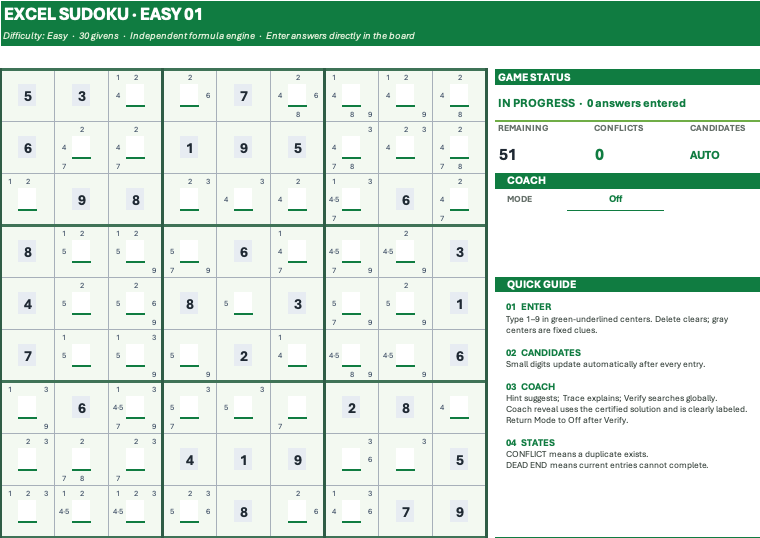

# Formula-Only Sudoku in Excel

A playable, five-difficulty Sudoku workbook built entirely with modern Excel formulas. It combines a stateful board, live candidates, conflict detection, logical coaching, recursive verification, uniqueness certification, and an automated regression suite—without VBA, macros, Office Scripts, or an external runtime.

The workbook was developed through collaboration between an AI agent and Excel's formula system. The interesting part is not merely solving Sudoku, but exploring how far a spreadsheet can behave like a self-contained interactive program while remaining inspectable as an Excel notebook.

[Download the workbook](https://raw.githubusercontent.com/sleetdrop/vibexcel/main/Sudoku/sudoku.xlsx)

## Preview

## Why This Is Interesting

The visible game pages contain very little calculation logic. Five isolated hidden engines collect player state and call 51 reusable `SDK_*` Named LAMBDA functions for validation, search, certification, and presentation. The current candidate and Coach path also uses 27 `SDKP_*` candidate-chain helpers.

The workbook also carries its own documentation. Its `README` sheet explains how to play, while `Formula Reference` documents the public formula layers and contracts. If the file is shared without this repository, it remains understandable and inspectable on its own.

## Features

- Five independent puzzles: Easy, Medium, Hard, Expert, and Master
- Live legal candidates rendered inside each empty square
- Immediate row, column, and box conflict detection
- Coach modes for one-step hints, explanations, and global verification
- Logical strategies covering singles, pointing, claiming, and naked pairs
- Transparent certified-solution fallback when supported logic is exhausted
- Minimum-remaining-values recursive solver, activated only on demand
- Bounded solution counting used to certify every shipped puzzle as unique
- Hidden formula regression suite with a clean release state
- Formula-only runtime with no executable scripting layer

## Quick Start

1. Download and open [sudoku.xlsx](https://raw.githubusercontent.com/sleetdrop/vibexcel/main/Sudoku/sudoku.xlsx) in Microsoft Excel 365 Desktop.
2. If Excel opens the downloaded file read-only or in Protected View, enable editing.
3. Start on `01 Easy`, or choose another numbered difficulty sheet.
4. Enter a digit from 1 to 9 in a green-underlined center cell.
5. Press Delete or Backspace to clear an answer.
6. Watch candidates, remaining cells, conflicts, and game status update automatically.

Gray centers contain fixed clues and are protected from accidental clearing. Green-underlined centers and the Coach mode selector remain editable.

To reset a puzzle, delete entries from its green-underlined centers or reopen a clean copy of the workbook.

## Coach Modes

- **Off** — normal play; global search remains dormant.
- **Hint** — shows one supported logical step, or a clearly labeled Coach reveal when the supported strategy stack is exhausted.
- **Trace** — separates the detected technique from the action to take.
- **Verify** — runs a global recursive check and reports whether the current board remains viable.

Verify is a persistent dropdown state because formulas cannot reset an input cell themselves. Return the mode to **Off** after verification.

## Workbook Structure

| Sheet | Visibility | Purpose |
|---|---:|---|
| `README` | Visible | Portable introduction, instructions, compatibility, and release information |
| `01 Easy`–`05 Master` | Visible | Five independent playable Sudoku pages |
| `Formula Reference` | Visible | Canonical human-readable formula API and engineering notes |
| `_Tests` | Hidden | Regression contracts and release-state checks |
| `_Engine` plus four difficulty engines | Hidden | Isolated live state, candidates, validation, Coach output, and solver gates |

The hidden sheets remain ordinary inspectable worksheets; hiding keeps the player experience focused rather than concealing the implementation.

## Formula Architecture

Read [Formula architecture](FORMULA_ARCHITECTURE.md) for the calculation layers, data flow, Coach pipeline, recursive search boundary, uniqueness certification, and formula-only interaction constraints.

For source review without opening the binary workbook, see the generated [Named LAMBDA snapshot](NAMED_FORMULAS.md). It records the 51 `SDK_*` definitions from its source workbook and that workbook's SHA-256; inspect the current workbook for the active `SDKP_*` chain definitions.

## Compatibility and Performance

Sudoku v1.0.0 is verified on **Microsoft Excel 365 Desktop for macOS** and depends on modern dynamic-array and LAMBDA functionality.

**Excel 365 for Windows, Excel 2024, and Excel for the Web are currently unverified.** They may work, but this release does not claim support for them.

Ordinary play uses fast local checks. **Verify** invokes global recursive search and may take several seconds. The Master puzzle can take substantially longer on slower computers. Return Verify to Off afterward so the recursive calculation gate becomes dormant again.

## Verification

- Version: `1.0.0`
- Build date: `2026-07-27`
- Current workbook baseline: `131 checks passing · 18 on demand` (Coach Off; checked 2026-09-24)
- Published puzzles certified unique: `5 / 5`
- Named LAMBDA functions: `51 SDK_*` names
- Candidate-chain helpers: `27 SDKP_*` names
- Package hygiene verified: `2026-09-04` (no embedded Office add-in or Web Extension parts)

The on-demand group includes expensive checks and visual contracts that are not continuously evaluated during ordinary play. The workbook opens with empty player entries, Coach Off, zero conflicts, candidates Auto, and every puzzle In Progress.

## Canonical Source

The Excel workbook is the canonical executable artifact. User guidance is authoritative in its `README` sheet, Named LAMBDA definitions are authoritative in Name Manager, and `Formula Reference` is the canonical human-readable API catalog.

Repository formula documentation is a versioned, read-only snapshot generated from the released workbook. Formula changes belong in Excel first; the snapshot is regenerated afterward rather than maintained as a second implementation.
