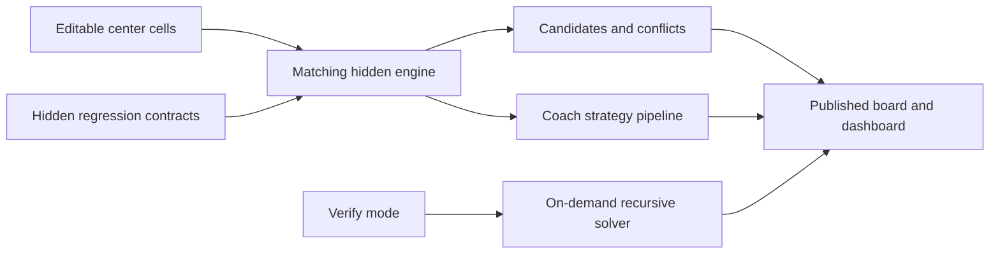

# Sudoku Documentation and Formula Snapshot Implementation Plan

> **For agentic workers:** REQUIRED SUB-SKILL: Use superpowers:subagent-driven-development (recommended) or superpowers:executing-plans to implement this plan task-by-task. Steps use checkbox (`- [ ]`) syntax for tracking.

**Goal:** Publish Sudoku as a self-contained Excel notebook with a concise GitHub introduction, a conceptual formula architecture guide, a deterministic snapshot of all 51 Named LAMBDA definitions, and a clean workbook preview.

**Architecture:** Treat `Sudoku/sudoku.xlsx` as the canonical executable and documentation source. Keep the workbook unchanged in this phase; extract its `SDK_*` definitions into a generated, read-only Markdown snapshot, then add complementary repository prose and a preview without duplicating the workbook's complete Formula Reference table.

**Tech Stack:** Microsoft Excel 365 Desktop, `.xlsx` Open Packaging Convention XML, Node.js ESM and built-in modules, the system `unzip` command, Markdown, PNG, Git.

## Global Constraints

- All published documentation is English.
- The workbook remains the canonical executable artifact.
- User guidance is authoritative in the workbook README; Named LAMBDA definitions are authoritative in Excel Name Manager; the workbook Formula Reference is the canonical human-readable API catalog.
- Repository formula documentation is generated from the released workbook and is never a second editable implementation.
- Runtime behavior remains formula-only: no VBA, macros, Office Scripts, external services, or runtime dependencies.
- Do not change Sudoku gameplay, puzzles, formulas, solving strategies, worksheet layout, workbook filename, or version in this phase.
- Version is `1.0.0`; build date is `2026-07-27`.
- Official support is Microsoft Excel 365 Desktop. Excel 2024 and Excel for Web remain unverified.
- Published test status is `79 PASS / 18 on demand` while Verify is Off.
- `Sudoku/~$sudoku.xlsx`, `.DS_Store`, and `docs/superpowers/` are not public project artifacts and must not be staged in documentation commits.
- Keep `Sudoku/sudoku.xlsx` byte-for-byte unchanged during this plan.

---

### Task 1: Build and test the Named LAMBDA snapshot extractor

**Files:**
- Create: `tools/extract_named_formulas.mjs`
- Create: `tools/extract_named_formulas.test.mjs`
- Test: `tools/extract_named_formulas.test.mjs`

**Interfaces:**
- Consumes: an `.xlsx` path, output Markdown path, version string, and extraction date.
- Produces: deterministic Markdown containing every non-empty workbook name beginning with `SDK_`, sorted by name.
- Exports for tests: `decodeXmlEntities(text)`, `normalizeFormula(formula)`, `extractSdkNames(xml)`, and `renderSnapshot(metadata)`.
- CLI: `node tools/extract_named_formulas.mjs --workbook <xlsx> --output <md> --version <version> --date <yyyy-mm-dd> --expected-count <integer>`.

- [ ] **Step 1: Write focused failing unit tests**

Create `tools/extract_named_formulas.test.mjs` with Node's built-in `node:test` and `node:assert/strict`. The fixture must include `SDK_Zeta`, `SDK_Alpha`, and a non-SDK name. Assert that:

```js
assert.equal(decodeXmlEntities("A&amp;B&lt;C&#10;D"), "A&B<C\nD");
assert.equal(
  normalizeFormula("=_xlfn.LAMBDA(_xlpm.board,_xlpm.board&lt;9)"),
  "=LAMBDA(board,board<9)",
);
assert.deepEqual(
  extractSdkNames(fixtureXml).map(({ name }) => name),
  ["SDK_Alpha", "SDK_Zeta"],
);
assert.match(markdown, /Formula count: `2`/);
assert.match(markdown, /## `SDK_Alpha`[\s\S]*```excel[\s\S]*=LAMBDA/);
assert.ok(markdown.indexOf("SDK_Alpha") < markdown.indexOf("SDK_Zeta"));
```

The fixture's `SDK_Alpha` defined name must contain a `description` attribute so the test also asserts that the decoded comment appears in the rendered Markdown.

- [ ] **Step 2: Run the unit test and verify RED**

Run:

```bash
node --test tools/extract_named_formulas.test.mjs
```

Expected: failure because `tools/extract_named_formulas.mjs` does not exist or does not export the required functions.

- [ ] **Step 3: Implement XML extraction and display normalization**

Create `tools/extract_named_formulas.mjs` using only these Node built-ins:

```js
import { execFileSync } from "node:child_process";
import { createHash } from "node:crypto";
import { readFileSync, writeFileSync } from "node:fs";
import { basename, resolve } from "node:path";
import { pathToFileURL } from "node:url";
```

Implement the exported functions with these contracts:

```js
export function decodeXmlEntities(text) // named + decimal + hexadecimal entities
export function normalizeFormula(formula) // decode XML, remove _xlfn. and _xlpm.
export function extractSdkNames(xml) // [{ name, comment, formula }], alphabetical
export function renderSnapshot({ workbookName, version, extractionDate, sha256, names })
```

`extractSdkNames` must read `<definedName ...>formula</definedName>` elements, select only `name="SDK_*"`, decode the optional `description` attribute, reject empty formulas, and sort with `localeCompare("en")`.

The CLI must:

1. parse the six required flags;
2. run `unzip -tqq <workbook>` and fail on a non-zero exit;
3. run `unzip -p <workbook> xl/workbook.xml`;
4. calculate SHA-256 from the exact workbook bytes with `createHash("sha256")`;
5. require the extracted count to equal `--expected-count`;
6. render Markdown ending in exactly one newline;
7. create no directory implicitly and overwrite only the explicit `--output` path;
8. print `Wrote <count> formulas to <output>` on success.

The generated header must include this exact warning:

```text
Generated file — do not edit manually. The Excel workbook is the canonical executable artifact; formulas are normalized for display by removing storage-only `_xlfn.` and `_xlpm.` prefixes.
```

- [ ] **Step 4: Run the unit test and verify GREEN**

Run:

```bash
node --test tools/extract_named_formulas.test.mjs
```

Expected: all tests pass with zero failures.

- [ ] **Step 5: Verify CLI failure behavior against an incorrect count**

Run:

```bash
node tools/extract_named_formulas.mjs --workbook Sudoku/sudoku.xlsx --output /tmp/sudoku-formulas-invalid.md --version 1.0.0 --date 2026-07-28 --expected-count 50
```

Expected: non-zero exit and an error stating that 51 names were found but 50 were expected. `/tmp/sudoku-formulas-invalid.md` must not be created.

- [ ] **Step 6: Commit the tested extractor**

Run:

```bash
git add tools/extract_named_formulas.mjs tools/extract_named_formulas.test.mjs
git commit -m "build: add Named LAMBDA snapshot extractor"
```

Expected: only the extractor and its test are committed.

---

### Task 2: Generate and verify the 51-formula snapshot

**Files:**
- Create: `Sudoku/NAMED_FORMULAS.md`
- Verify: `Sudoku/sudoku.xlsx`
- Use: `tools/extract_named_formulas.mjs`

**Interfaces:**
- Consumes: the committed workbook bytes and Task 1 CLI.
- Produces: a searchable, versioned, read-only formula snapshot linked by later documentation.

- [ ] **Step 1: Generate two independent snapshots**

Run:

```bash
node tools/extract_named_formulas.mjs --workbook Sudoku/sudoku.xlsx --output /tmp/sudoku-formulas-a.md --version 1.0.0 --date 2026-07-28 --expected-count 51
node tools/extract_named_formulas.mjs --workbook Sudoku/sudoku.xlsx --output /tmp/sudoku-formulas-b.md --version 1.0.0 --date 2026-07-28 --expected-count 51
```

Expected: both commands report 51 formulas.

- [ ] **Step 2: Prove deterministic output**

Run:

```bash
cmp /tmp/sudoku-formulas-a.md /tmp/sudoku-formulas-b.md
```

Expected: exit code 0 with no output.

- [ ] **Step 3: Generate the repository snapshot**

Run:

```bash
node tools/extract_named_formulas.mjs --workbook Sudoku/sudoku.xlsx --output Sudoku/NAMED_FORMULAS.md --version 1.0.0 --date 2026-07-28 --expected-count 51
```

- [ ] **Step 4: Verify count, integrity metadata, and completeness**

Run:

```bash
test "$(rg -c '^## `SDK_' Sudoku/NAMED_FORMULAS.md)" -eq 51
test "$(shasum -a 256 Sudoku/sudoku.xlsx | cut -d ' ' -f 1)" = "$(rg -o '[0-9a-f]{64}' Sudoku/NAMED_FORMULAS.md | head -1)"
rg -n 'Generated file|Workbook version: `1\.0\.0`|Formula count: `51`|```excel' Sudoku/NAMED_FORMULAS.md
```

Expected: count and hash checks exit 0; the generated warning, version, count, and formula fences are present.

- [ ] **Step 5: Spot-check complex and commented functions**

Confirm the snapshot contains complete sections for:

```text
SDK_Candidates
SDK_CoachHintV2
SDK_PlayerHint
SDK_Solve
SDK_CountSolutions
SDK_Uniqueness
```

Run:

```bash
rg -n '^## `SDK_(Candidates|CoachHintV2|PlayerHint|Solve|CountSolutions|Uniqueness)`' Sudoku/NAMED_FORMULAS.md
rg -n '_xlfn\.|_xlpm\.' Sudoku/NAMED_FORMULAS.md
```

Expected: six section matches; no storage-only prefix matches.

- [ ] **Step 6: Commit the generated snapshot**

Run:

```bash
git add Sudoku/NAMED_FORMULAS.md
git commit -m "docs: publish Sudoku Named LAMBDA snapshot"
```

---

### Task 3: Capture the clean workbook preview

**Files:**
- Create: `Sudoku/Preview.png`
- Verify: `Sudoku/sudoku.xlsx`, sheet `01 Easy`, range `B1:BH30`

**Interfaces:**
- Consumes: the connected Excel 365 workbook in its clean startup state.
- Produces: a GitHub-readable PNG showing the actual published interface without editor chrome.

- [ ] **Step 1: Reconfirm the connected workbook and clean state**

Use the connected Excel session and direct spreadsheet tools to read:

```text
'01 Easy'!AM5   status begins with IN PROGRESS
'01 Easy'!AM8   remaining count agrees with the puzzle
'01 Easy'!AU8   0 conflicts
'01 Easy'!AS11  Off
'01 Easy'!BC8   AUTO
'01 Easy'!AM20  blank
```

Also search the workbook for exact displayed `FAIL` and common evaluated errors. Expected: no matches.

- [ ] **Step 2: Capture the exact published range**

Read an image of:

```text
'01 Easy'!B1:BH30
```

Use the live Excel range-image result as the source. Save the returned PNG bytes directly as `Sudoku/Preview.png`; do not recreate, redraw, or use image generation.

If the live connector cannot persist its returned image bytes, use the `computer-use` skill to capture the same visible worksheet region from Excel, then crop only application chrome. Do not alter workbook content or formatting.

- [ ] **Step 3: Inspect the saved PNG**

Use the local image viewer on `Sudoku/Preview.png` and confirm:

- the entire board and right-side panels are present;
- the Quick Guide has no spill-through or clipping;
- no active-cell border, dropdown, formula bar, ribbon, window chrome, or cursor obscures the interface;
- text remains legible at GitHub README width;
- the image is the Easy page, not another difficulty.

- [ ] **Step 4: Verify file type and dimensions**

Run:

```bash
file Sudoku/Preview.png
sips -g pixelWidth -g pixelHeight Sudoku/Preview.png
```

Expected: a valid PNG with width at least 1000 pixels and a landscape aspect ratio.

- [ ] **Step 5: Commit the preview**

Run:

```bash
git add Sudoku/Preview.png
git commit -m "docs: add Sudoku workbook preview"
```

---

### Task 4: Write the GitHub project README and formula architecture guide

**Files:**
- Create: `Sudoku/README.md`
- Create: `Sudoku/FORMULA_ARCHITECTURE.md`
- Read: `Sudoku/NAMED_FORMULAS.md`
- Verify: `Sudoku/sudoku.xlsx`, workbook README and Formula Reference facts

**Interfaces:**
- Consumes: the released workbook, preview, generated snapshot, and canonical facts from the workbook.
- Produces: a concise discovery/onboarding document and a complementary conceptual technical guide.

- [ ] **Step 1: Write the project README with the approved information hierarchy**

Create `Sudoku/README.md` with these headings in this order:

```markdown
# Formula-Only Sudoku in Excel

## Preview
## Why This Is Interesting
## Features
## Quick Start
## Coach Modes
## Workbook Structure
## Formula Architecture
## Compatibility and Performance
## Verification
## Canonical Source
```

Required exact facts and links:

- Link `[Download the workbook](sudoku.xlsx)` near the opening.
- Render `` under Preview.
- State explicitly: no VBA, macros, Office Scripts, or external runtime.
- State that the workbook was built through collaboration between an AI agent and Excel's formula system, without claiming autonomous correctness.
- Explain editable green-underlined centers and Delete/Backspace reset behavior.
- Define Coach modes: Off, Hint, Trace, Verify; tell users to return Verify to Off afterward.
- List five difficulty sheets, Formula Reference, hidden `_Tests`, and five hidden engines.
- Link `[Formula architecture](FORMULA_ARCHITECTURE.md)` and `[Named LAMBDA snapshot](NAMED_FORMULAS.md)`.
- State Microsoft Excel 365 Desktop support and mark Excel 2024/Web unverified.
- State that Verify may take several seconds and Master may take substantially longer on slower computers.
- State version `1.0.0`, build date `2026-07-27`, and `79 checks passing · 18 on demand`.
- State that the workbook remains the canonical executable artifact and contains its own README and Formula Reference.

Keep the opening section under 120 words and the complete README easy to scan. Do not paste formulas into it.

- [ ] **Step 2: Write the conceptual architecture guide**

Create `Sudoku/FORMULA_ARCHITECTURE.md` with these headings:

```markdown
# Sudoku Formula Architecture

## Execution Boundary
## Workbook Data Flow
## Isolated Puzzle Engines
## Candidate and Validation Layer
## Coach Reasoning Pipeline
## Transparent Fallback
## On-Demand Recursive Solver
## Bounded Uniqueness Certification
## Regression Contracts
## Formula-Only Interaction Limits
## Inspecting the Implementation
```

Under Workbook Data Flow, include one Mermaid flowchart with this topology:



Required technical facts:

- Each visible puzzle has one isolated hidden engine.
- `SDK_Candidates` performs row/column/box exclusion; `SDK_CandidateMatrix` centralizes the 9×9 candidate state.
- Coach priority is singles, pointing, claiming, then naked pair.
- `SDK_PlayerHint` and `SDK_PlayerTrace` use a transparent certified-solution fallback only after supported logic is exhausted.
- Fallback output is labeled as a Coach reveal and is not presented as logical deduction.
- `SDK_Solve` uses minimum-remaining-values recursive backtracking and is gated behind Verify.
- `SDK_CountSolutions` stops at a caller-supplied bound; publication certification caps at two solutions.
- All five shipped puzzles were certified unique.
- The hidden suite contains 79 passing and 18 on-demand/visual checks in the release state.
- Formula-only limitations include persistent dropdown state, no automatic reset of Verify, and heavier recursive calculations.
- Direct readers to the workbook Formula Reference for the canonical API catalog and to `NAMED_FORMULAS.md` for the generated exact definitions.

Do not duplicate the 51 formula bodies or the six-column Formula Reference table.

- [ ] **Step 3: Verify links and factual consistency**

Run:

```bash
test -f Sudoku/sudoku.xlsx
test -f Sudoku/Preview.png
test -f Sudoku/FORMULA_ARCHITECTURE.md
test -f Sudoku/NAMED_FORMULAS.md
rg -n "1\.0\.0|2026-07-27|79 checks passing|Excel 365 Desktop|Excel 2024|Excel for Web|Verify" Sudoku/README.md
rg -n "SDK_Candidates|SDK_CandidateMatrix|SDK_PlayerHint|SDK_PlayerTrace|SDK_Solve|SDK_CountSolutions|79 passing|18 on-demand" Sudoku/FORMULA_ARCHITECTURE.md
```

Expected: all file checks pass and every required fact is found.

- [ ] **Step 4: Review Markdown readability**

Read both documents from top to bottom and confirm:

- no paragraph merely repeats the preceding section;
- terminology matches the workbook (`Coach`, `Verify`, `Formula Reference`, `SDK_*`);
- all relative links resolve from `Sudoku/`;
- no compatibility claim exceeds the verified boundary;
- the architecture document complements rather than copies the workbook reference.

- [ ] **Step 5: Commit the project documentation**

Run:

```bash
git add Sudoku/README.md Sudoku/FORMULA_ARCHITECTURE.md
git commit -m "docs: explain Sudoku usage and formula architecture"
```

---

### Task 5: Add Sudoku to the repository landing page

**Files:**
- Modify: `README.md`
- Verify: `Sudoku/README.md`, `Sudoku/sudoku.xlsx`, `Hanoi/README.md`

**Interfaces:**
- Consumes: the completed Sudoku project documentation.
- Produces: a repository landing page that presents both projects and the AI-agent/formula research goal.

- [ ] **Step 1: Update the repository description**

Keep the title `# vibexcel`. Replace the opening sentence and About section so they clearly state that the repository explores the capability boundary between AI agents and modern Excel formulas through self-contained interactive workbooks.

Keep this constraint block prominent and exact:

```text
No VBA. No macros. No Office Scripts. No external runtimes.
```

- [ ] **Step 2: Add Sudoku to the Projects table**

Use repository-relative links and place Sudoku before Hanoi:

```markdown
| [Sudoku](Sudoku/README.md) | A five-difficulty Sudoku game with live candidates, logical coaching, recursive verification, uniqueness certification, and regression tests — implemented with formulas only. |
| [Hanoi](Hanoi/README.md) | A Tower of Hanoi step-by-step visualization implemented with formulas only. |
```

Add a direct workbook link within the Sudoku description or an adjacent Download column only if the table remains readable at ordinary GitHub width.

- [ ] **Step 3: Refine requirements without overgeneralizing**

State that modern dynamic-array formulas such as `LET`, `LAMBDA`, `SCAN`, and `REDUCE` are common across the repository. Add a project-specific note that Sudoku v1.0.0 is verified on Microsoft Excel 365 Desktop; do not claim that every workbook has the same compatibility boundary.

- [ ] **Step 4: Verify landing-page links and scope**

Run:

```bash
test -f Sudoku/README.md
test -f Sudoku/sudoku.xlsx
test -f Hanoi/README.md
test -f Hanoi/Hanoi-1.0.xlsx
rg -n "AI agents|No VBA|Sudoku|Hanoi|Excel 365 Desktop" README.md
```

Expected: all targets exist and each required repository message appears.

- [ ] **Step 5: Commit the landing-page update**

Run:

```bash
git add README.md
git commit -m "docs: add Sudoku to project index"
```

---

### Task 6: Run the complete documentation release gate

**Files:**
- Verify: `Sudoku/sudoku.xlsx`
- Verify: `Sudoku/Preview.png`
- Verify: `Sudoku/README.md`
- Verify: `Sudoku/FORMULA_ARCHITECTURE.md`
- Verify: `Sudoku/NAMED_FORMULAS.md`
- Verify: `README.md`
- Verify: `tools/extract_named_formulas.mjs`
- Verify: `tools/extract_named_formulas.test.mjs`

**Interfaces:**
- Consumes: all documentation-phase deliverables.
- Produces: evidence that the release package is internally consistent, reproducible, reviewable, and free of temporary artifacts.

- [ ] **Step 1: Run extractor tests and deterministic regeneration**

Run:

```bash
node --test tools/extract_named_formulas.test.mjs
node tools/extract_named_formulas.mjs --workbook Sudoku/sudoku.xlsx --output /tmp/sudoku-formulas-final.md --version 1.0.0 --date 2026-07-28 --expected-count 51
cmp /tmp/sudoku-formulas-final.md Sudoku/NAMED_FORMULAS.md
```

Expected: tests pass, 51 formulas are reported, and `cmp` produces no output.

- [ ] **Step 2: Verify workbook package and formula-only boundary**

Run:

```bash
unzip -t Sudoku/sudoku.xlsx
unzip -l Sudoku/sudoku.xlsx | rg "vbaProject|externalLinks|connections|customXml"
```

Expected: ZIP validation reports no errors; the second command has no matches. Treat its no-match exit code as success.

- [ ] **Step 3: Recheck workbook runtime facts in Excel**

With the connected workbook, verify:

```text
README!D45 = 79 checks passing · 18 on demand
README!D54 = 1.0.0
README!D55 = 2026-07-27
README!D56 = Microsoft Excel 365 Desktop
README!D57 = Excel 2024 · Excel for Web (unverified)
```

Search for exact displayed `FAIL` and the regular expression `#(REF!|VALUE!|NAME\?|CALC!|SPILL!|DIV/0!)`. Expected: no matches.

- [ ] **Step 4: Verify all public documentation files and links**

Run:

```bash
test -f Sudoku/sudoku.xlsx
test -f Sudoku/Preview.png
test -f Sudoku/README.md
test -f Sudoku/FORMULA_ARCHITECTURE.md
test -f Sudoku/NAMED_FORMULAS.md
test -f Hanoi/README.md
test "$(rg -c '^## `SDK_' Sudoku/NAMED_FORMULAS.md)" -eq 51
git diff --check
```

Read the three Sudoku documentation surfaces together and confirm that version, compatibility, reset, Verify performance, canonical-source wording, and test counts do not contradict one another.

- [ ] **Step 5: Perform final visual inspection**

View `Sudoku/Preview.png` at original resolution and at approximately 900 pixels wide. Confirm the board, dashboard, Coach controls, candidates, and Quick Guide remain legible and no Excel chrome is visible.

- [ ] **Step 6: Confirm public commit scope**

Run:

```bash
git status --short
git ls-files Sudoku tools README.md
```

Expected:

- `Sudoku/~$sudoku.xlsx` may remain untracked while Excel is open;
- it is not listed by `git ls-files`;
- `.DS_Store` is not newly staged;
- all intended Sudoku docs, preview, workbook, extractor, tests, and root README are tracked;
- no unrelated file is staged.

- [ ] **Step 7: Record the release checkpoint**

If verification required no repair commit, do not create an empty commit. Record the verified HEAD commit and workbook SHA-256 in the implementation handoff, then transition to the separate Hanoi review/design cycle.
